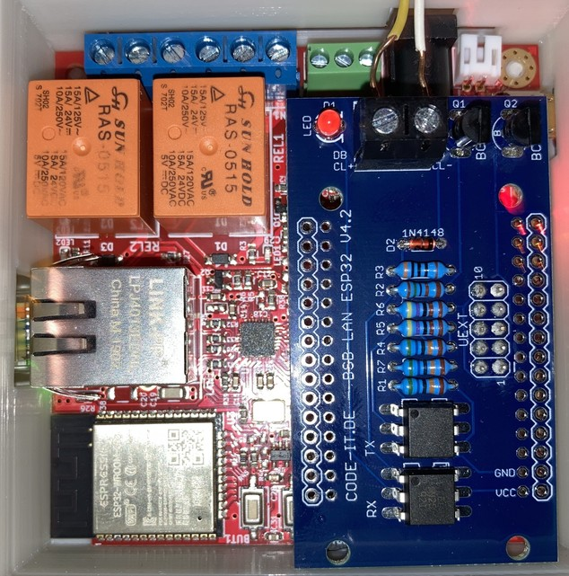

[Zurück zur Schnellstartanleitung für den Arduino Due](SSA_DUE.md)    
    
---
    
# Schnellstartanleitung für [ESP32-Boards](kap01.md#13-esp32)
***Die folgende Kurzanleitung ersetzt nicht das Lesen des ausführlichen Handbuchs!***    
***Bitte lies ebenso die jeweiligen detaillierteren Ausführungen in den entsprechenden Kapiteln.*** 
   
*Achtung: Berücksichtige bei der folgenden Anleitung deinen ESP32-Boardtyp!*   

- ***[Joy-It ESP32 NodeMCU](kap01.md#1311-esp32-nodemcu-joy-it)***  
  Stecke den NodeMCU auf den BSB-LAN-Adapter und verbinde den NodeMCU mit einem USB-Kabel mit deinem Computer.  
  Sollte dein Rechner den NodeMCU nicht automatisch erkennen, ist der entspr. Treiber für dein Betriebssystem zu installieren.  

  
    
  *Das komplette Setup: Joy-It ESP32 NodeMCU samt aufgestecktem "BSB-LAN ESP32"-Adapter v4.2.*  

- ***[Olimex ESP32-EVB & ESP32-PoE](kap01.md#1312-esp32-olimex-esp32-evb--esp32-poe)***  
  Stecke den BSB-LAN-Adapter auf den Olimex und verbinde den Olimex mit einem USB-Kabel mit deinem Computer.  
  **Achte beim Aufstecken des Adapterboards penibel darauf, dass die UEXT1-Buchse der Platine ***exakt in der Mitte*** der Olimex-Buchse aufgesteckt wird und alle Pins des Olimex Kontakt haben!** Ansonsten leuchtet beim korrekten Anschluss des Adapters an den Heizungsregler zwar die LED des Adapters, es ist aber kein Zugriff auf den Regler möglich.
  **Ebenso ist auf die korrekte Ausrichtung der Platine zu achten (s. Foto)!**
  
  Sollte dein Rechner den Olimex nicht automatisch erkennen, ist der entspr. Treiber für dein Betriebssystem zu installieren.  

  
    
  *Das komplette Setup: Olimex ESP32-EVB samt aufgestecktem "BSB-LAN ESP32"-Adapter v4.2.*  
  
    
  
  *Das komplette Setup: Olimex ESP32-PoE samt aufgestecktem "BSB-LAN ESP32"-Adapter v4.4.*
  
Führe nun die folgenden Schritte aus:  
  
1. Downloade und installiere die aktuelle Version der [Arduino IDE](https://www.arduino.cc/en/Main/Software).  
   Füge dann das ESP32-SDK per Boardverwalter-URL hinzu (*Achtung: SDK 2.0.2 oder höher verwenden!*) und installiere dann die ESP32-Boardbibliotheken im Boardverwalter. [Hier](kap12.md#1212-esp32) findest du eine ausführliche Schritt-für-Schritt-Anleitung dazu.    
   
2. Downloade die [aktuelle Version von BSB-LAN](https://github.com/fredlcore/bsb_lan/archive/master.zip).  

3. Entpacke die heruntergeladene Datei "BSB_LAN-master.zip" und wechsle in den Ordner.  

4. Wechsle in den Ordner "BSB-LAN-master"/"BSB_LAN" und benenne die Dateien *BSB_LAN_custom_defs.h.default* in ***BSB_LAN_custom_defs.h*** sowie  *BSB_LAN_config.h.default* in ***BSB_LAN_config.h*** um!    

   - Öffne die Datei "BSB_LAN_config.h" und aktiviere das Definement `#define WIFI`, wenn du WLAN verwenden willst. Solltest du ein Olimex-Board verwenden und den LAN-Anschluss nutzen wollen, lasse das Definement bitte auskommentiert: `//#define WIFI`.   
    
   - Trage bei der Verwendung von WLAN die Zugangsdaten für dein WLAN-Netzwerk bei den Einträgen  
    `char wifi_ssid[32] = "YourWiFiNetwork";` sowie  
    `char wifi_pass[64] = "YourWiFiPassword";` ein.  

5. Starte die Arduino IDE mit einem Doppelklick auf die Datei "BSB_LAN.ino" im BSB_LAN-Ordner.  

   - Überprüfe den korrekten seriellen Port, an dem das ESP32-Board am Rechner angeschlossen ist, unter "Werkzeuge/Port".  
   
   - Stelle die Übertragungsgeschwindigkeit/Baudrate auf 115200 ein.  
   
    | Achtung |
    |:--------|
    | Wähle nun den entspr. ESP32-Boardtyp unter Tools/Board bzw. Werkzeuge/Board aus! |  
   
   - Für den in diesem Handbuch empfohlenen [Joy-It ESP32-NodeMCU](kap01.md#1311-esp32-nodemcu-joy-it) (oder identische Clones mit einem "ESP32-WROOM"-Chip) lautet der passende Boardtyp "ESP32 Dev Module".   Wähle dann bei "Partition Scheme" die Variante "Default 4MB with spiffs (1.2BM APP/1.5MB SPIFFS)" aus.    
   
   - Für das empfohlene [Olimex ESP32-EVB](kap01.md#1312-esp32-olimex-esp32-evb) wähle bitte den gleichnamigen Eintrag aus der Liste aus.   Wähle dann bei "Partition Scheme" die Variante "Minimal SPIFFS (Large APPS with OTA)" aus.  
   
   | Hinweis |
   |:--------|
   | Sollten bis hier Probleme auftreten (bspw., dass das Board nicht erkannt wird), lies bitte die ausführliche Beschreibung in [Kapitel 2.1.2](kap02.md#212-installation-auf-dem-esp32)! |    

6. Passe die weiteren Einstellungen in der Datei "BSB_LAN_config.h" deinen Wünschen und Gegebenheiten entsprechend an.  
   Dies gilt insbesondere für Einstellungen hinsichtlich der Nutzung von DHCP, einer ggf. abweichenden IP-Adresse sowie der optionalen Sicherheitsfunktionen.   
   
   Wenn alle Einstellungen angepasst wurden, starte den Flashvorgang mittels Klick auf "Sketch/Upload" bzw. "Sketch/Hochladen".  

   | Hinweis |
   |:--------|
   | Zusätzlich zur Anpassung der Datei "BSB_LAN_config.h" kann die Anpassung der Konfiguration von BSB-LAN auch später per Webinterface erfolgen. | 
   | Weitere Hinweise sowie eine Beschreibung sämtlicher Konfigurationsmöglichkeiten findest du in [Kapitel 2.2 Konfiguration](kap02.md#22-konfiguration)! |   
  
7. Nach Beenden des Flashvorgangs starte den [Seriellen Monitor der Arduino IDE](kap12.md#122-serieller-monitor) und beobachte die Ausgaben, die beim Start des ESP32 erfolgen. Dort wird u.a. auch die IP ausgegeben, die dem Setup bei Verwendung von DHCP zugeteilt wird.  

   Nach Beenden des Startvorgangs kannst du die Stromversorgung des ESP32-Boards unterbrechen, also das Board vom USB-Port deines Rechners entfernen. Dies ist nicht zwingend nötig, aus Sicherheitsgründen jedoch zu empfehlen.  

8. Schalte deine Heizung aus, damit der Heizungsregler stromlos ist.  
  
   Schließe nun den Adapter des Arduino-Setups an den Regler an. Verbinde dazu die reglerseitigen Anschlüsse "CL+" und "CL-" (bei BSB-Verwendung) bzw. "DB" und "MB" (bei LPB-Verwendung) mit den gleichnamigen Anschlüssen des Adapters.  
   Achte auf die korrekte Verbindung: Die verbundenen Anschlüsse müssen *namensgleich* sein, also bspw. "CL+" an "CL+" und "CL-" an "CL-"!   
  
   | Hinweis |
   |:--------|
   | Eine ausführliche Anweisung diesbzgl. sowie Hinweise zum Anschluss eines Reglers mit PPS-Anschlüssen und Abbildungen diverser Regler und den entspr. zu nutzenden Anschlüssen findest du in [Kapitel 3.1](kap03.md#31-anschluss-des-adapters)! |  
   
9. Schalte die Heizung bzw. den Heizungsregler wieder ein.  

10. Starte das Setup durch Druck auf die Reset-Taste neu bzw. stelle die Stromversorgung des ESP32-Board-Setups wieder her, idealerweise mit einem spezifischen Netzteil mit Anschluss an der microUSB-Buchse (NodeMCU) bzw. Hohlsteckerbuchse (Olimex).  
    Solltest du (noch) kein geeignetes Netzteil zur Hand haben, kann die Stromversorgung auch über deinen USB-Port am Rechner erfolgen.  
    Letztere Variante ist insofern von Vorteil, als dass du den [Seriellen Monitor der Arduino IDE](kap12.md#122-serieller-monitor) parallel zur Kontrolle des Startverhaltens des Setups nutzen kannst.  

11. Starte einen Internetbrowser und rufe die Seite des BSB-LAN-Webinterfaces auf.  
    Diese findest du unter der IP-Adresse, die du zuvor bei Schritt 6 eingestellt hast (voreingestellt ist "192.168.178.88").  
    Solltest du DHCP verwenden, so kann die vergebene IP während der Startsequenz des Arduino mittels des [Seriellen Monitors der Arduino IDE](kap12.md#122-serieller-monitor) ausgelesen werden.   

    *Wenn alles fehlerfrei und korrekt installiert ist, hast du nun (eingeschränkten) Zugriff auf deinen Heizungsregler. Um Zugriff auf alle verfügbaren Parameter deines Reglers zu erhalten, beachte bitte Schritt 12!* 
    
    | Hinweis |
    |:--------|
    | Sollten wider Erwarten Fehler oder Probleme auftauchen, so lies bitte *zusätzlich zu den bereits genannten Kapiteln* auch die Kapitel [13](kap13.md), [14](kap14.md) und [15](kap15.md)! |  
  
12. *Um nun Zugriff auf sämtliche Parameter deines Reglers zu erhalten, muss eine reglerspezifische Datei `BSB_LAN_custom_defs.h` erstellt werden. Bitte lies hierfür das [Kap. 3.3](kap03.md#33-reglerspezifische-parameterliste-erstellen)!*     

    
---

    

---
    

     
     
[Zurück zum Inhaltsverzeichnis](inhaltsverzeichnis.md)  
