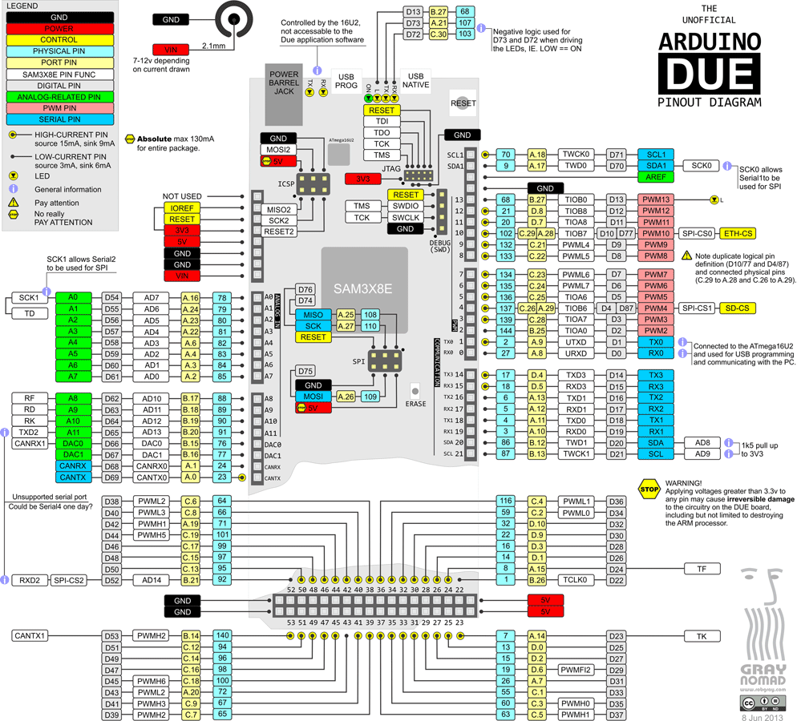
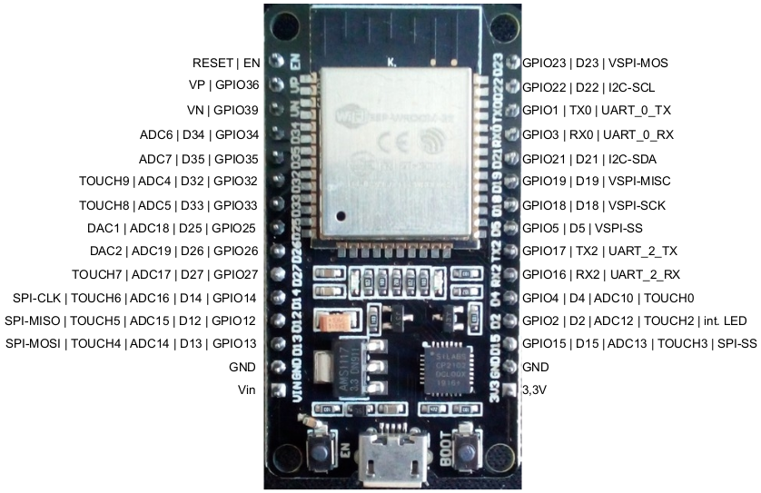
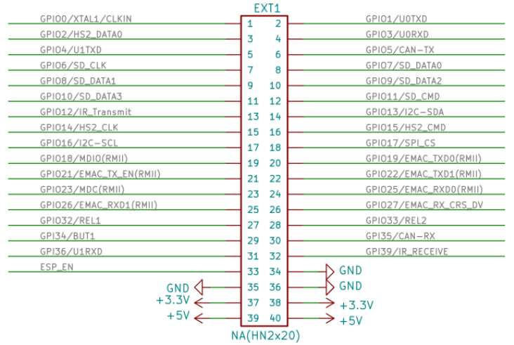

[Zurück zum Inhaltsverzeichnis](inhaltsverzeichnis.md)  
[Zurück zu Anhang A2](anhang_a2.md)    
    
---
        

# Anhang B: Pinouts

## B1 Arduino DUE
  
***Das nachfolgend abgebildete 'inoffizielle' Arduino DUE Pinout-Schema stammt von [Rob Gray](https://www.robgray.com).  
Es ist u.a. auch direkt als [PDF](http://www.robgray.com/temp/Due-pinout.pdf) verfügbar.  
Vielen Dank für die großartige Arbeit!***  
  
*Hinweis: Bitte beachte, dass das Pinout bei einigen günstigen Clones vom originalen Pinout abweichen kann!*    
   

---
    
**Das 'offizielle' Pinout-Schema von [Arduino.cc](https://store.arduino.cc/arduino-due) kann kann ebenfalls als [PDF](https://content.arduino.cc/assets/Pinout-Due_latest.pdf) heruntergeladen werden.**    
   
[Hier](https://docs.arduino.cc/hacking/hardware/PinMappingSAM3X) sind die entspr. GPIO-Nummern im Vergleich mit den Pin-Bezeichnungen auf dem Due aufgeführt.     
   
---       
     
## B2 Joy-It ESP32 NodeMCU

Das Pinout-Schema für den [Joy-It ESP32 NodeMCU](https://joy-it.net/de/products/SBC-NodeMCU-ESP32) ist in der [Bedienungsanleitung](https://joy-it.net/files/files/Produkte/SBC-NodeMCU-ESP32/SBC-NodeMCU-ESP32-Anleitung-2021-06-29.pdf) des Herstellers abgebildet.  
  

  
  
---
  
## B3 Olimex ESP32-EVB  
  
Das Pinout für den [Olimex ESP32-EVB](https://www.olimex.com/Products/IoT/ESP32/ESP32-EVB/open-source-hardware) ist im [Schaltplan](https://github.com/OLIMEX/ESP32-EVB/raw/master/HARDWARE/REV-I/ESP32-EVB_Rev_I.pdf) einsehbar. Die nachfolgende Abbildung zeigt den entspr. Ausschnitt daraus und bezieht sich auf die 40 polige Stiftleiste.  
  

  
*Pinout der 40 poligen Pinleiste des Olimex ESP32-EVB.*  
  
     
     
[Weiter zu Anhang C](anhang_c.md)      
[Zurück zum Inhaltsverzeichnis](inhaltsverzeichnis.md)  

